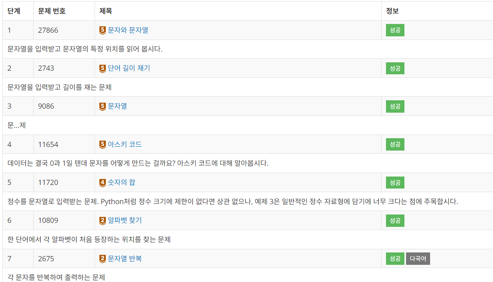

# 백준 5단계

### **theme** - 문자열

<br>

### ✅ 문제 1 \_ 문자와 문자

**문제**

단어S와 정수i가 주어졌을 때, S의 i번째 글자를 출력하는 프로그램을 작성하시오.

**필요개념**

String에서 한 글자만 뽑아낼 때, 배열처럼 쓰면 안 되고 **string.charAt()**을 \*\*\*\*사용해야 한다!

**정답코드**

```java
import java.util.*;

public class Main {
    public static void main(String[] args) {
        Scanner sc = new Scanner(System.in);
        String str = sc.nextLine();
        int size = sc.nextInt();
        System.out.println(str.charAt(size - 1));
    }
}
```

---

### ✅ 문제 2 \_ 단어 길이 재기

**문제**

알파벳으로만 이루어진 단어를 입력받아, 그 길이를 출력하는 프로그램을 작성하시오.

**필요개념**

String의 길이는 **length()**를 이용한다. 참고로 int형 배열, double형 배열 등의 배열은 **length** 메소드를 이용한다.

**정답코드**

```java
import java.util.*;

public class Main {
    public static void main(String[] args) {
        Scanner sc = new Scanner(System.in);
        String str = sc.nextLine();
        System.out.println(str.length());
    }
}
```

---

### ✅ 문제 3 \_ 문자열

**문제**

문자열을 입력으로 주면 문자열의 첫 글자와 마지막 글자를 출력하는 프로그램을 작성하시오.

**필요개념**

계속 런타임에러가 떠서 애를 먹었다,, ‘숫자 다음줄 문자열’ 의 형태라서 string을 받을 때 **sc.nextLine()**을 사용하면 개행만 가져온다고 한다,,,,, 그래서 이 점을 이용해 nextInt()로 문자를 먼저 받은 후, nextLine()으로 개행을 받아서 이후로는 string만 받을 수 있게 하려 했는데 생각해보니 3번의 string을 생성하는 것보다는 stringbuilder를 사용하는 것이 효율적이라고 생각해 **StringBuilder**를 사용했다!

- 📌 개인적으로 궁금해서 정리한 next()와 nextLine() 차이
  둘 다 string형을 받을 때 쓰는 메소드이지만 차이점이 있었다.
  - **next()** - 그냥 다음 토큰을 string으로 리턴하는 메소드. 분리자는 제외하고 읽어옴
  - **nextLine()** - 개행문자까지 읽어온다. 즉, 분리자도 다 읽어올 수 있다는 의미.예를 들어, 가<엔터> or 가나다 라마<엔터> 어떤식으로 입력이 되었든 <엔터> 까지 문자열을 모두 가져오게 된다. 물론 반환은 개행문자 이전 문자열만 반환된다.

**정답코드**

```java
import java.util.*;

public class Main {
    public static void main(String[] args) {
        Scanner sc = new Scanner(System.in);
        int n = sc.nextInt();

        StringBuilder sb = new StringBuilder();
        for (int i = 0; i < n; i++) {
            String str = sc.next();
            sb.append(str.charAt(0));
            sb.append(str.charAt(str.length()- 1) + "\n");
        }
        System.out.print(sb);
    }
}
```

---

### ✅ 문제 4 \_ 아스키코드 🌟🌟

**문제**

알파벳 소문자, 대문자, 숫자 0-9중 하나가 주어졌을 때, 주어진 글자의 아스키 코드값을 출력하는 프로그램을 작성하시오.

**필요개념**

사실 그냥 입력받은 것을 int형으로 출력하면 되는 문제이다. 그런데 한 글자를 받기 위해 Scanner를 이용하는 것이 비효율적이라는 내용을 보았다!

처음 안 사실이지만 System.in은 InputSstream 타입의 필드라고 한다. InputStream은 1byte만 읽어온다는 특징때문에 문자를 그대로 읽지 못하는 경우가 발생한다(특히 한글). 이때 문자형태 변환을 지원해주는 InputStreamReader를 사용한다.

InputStreamReader은 문자단위 데이터로 변환해준다. 하지만 “문자열”은 지원해주지 않아 문자열 입력을 원하면 배열을 선언해야 한다. 이러한 단점때문에 BufferedReader를 이용해 Buffer에 문자를 쌓아두고 문자열처럼 내보내는 방식으로 사용한다고 한다!

```java
BufferedReader br = new BufferedReader(new InputStreamReader(System.in));
```

즉 위 코드는 [System.in](http://System.in) = InputStream → InputStreamReader → BufferedReader 가 된다.

📌 **그렇다면 Scanner를 쓰는건 왜 비효율적?**

Scanner는 사용할 때 약 44줄의.. 정규식을 통과하여 검사한 후 반환한다. 그래서 속도가 느리기 때문에 시간 효율을 중요하게 생각하는 알고리즘에서는 BufferedReader가 선호될 수밖에 없다고 한다!

**정답코드**

1. Scanner 사용 (시간 200ms)

```java
import java.util.Scanner;
public class Main {
    public static void main(String[] args) {
        Scanner sc = new Scanner(System.in);
        int a = sc.next().charAt(0);

        System.out.println(a);
    }
}
```

1. 한 글자만 처리하면 되므로 System.in만 사용 (시간 132ms)

```java
public class Main {
    public static void main(String[] args) throws Exception {

        int a = System.in.read();
        System.out.print(a);
    }
}
```

겨우 한 글자 처리에도 시간차이가 꽤 났다 😮

---

### ✅ 문제 5 \_ 숫자의 합

**문제**

N개의 숫자가 공백 없이 쓰여있다. 이 숫자를 모두 합해서 출력하는 프로그램을 작성하시오.

**필요개념**

charAt()은 해당 문자의 아스키코드 값을 반환하기 때문에, 반드시 -48 또는 ‘-0’을 덧붙여줘야 한다고 한다!

아래 코드 말고도 Scanner를 써봤는데, 러닝타임이 거의 두배차이가 났다..! 버퍼랑 친해져야겠습니다..

**정답코드**

```java
import java.io.*;

public class Main {
    public static void main(String[] args) throws Exception {
        BufferedReader br = new BufferedReader(new InputStreamReader(System.in));

        br.readLine();
        int sum = 0;
        String num = br.readLine();

        for (int i = 0; i < num.length(); i++) {
            sum += num.charAt(i) - 48;
        }

        System.out.print(sum);
    }
}
```

---

### ✅ 문제 6 \_ 알파벳 찾기

**문제**

알파벳 소문자로만 이루어진 단어 S가 주어진다. 각각의 알파벳에 대해서, 단어에 포함되어 있는 경우에는 처음 등장하는 위치를, 포함되어 있지 않은 경우에는 -1을 출력하는 프로그램을 작성하시오.

**필요개념**

일단 배열을 다 -1로 채워둔 후, 알파벳이 나타나면 거기에 위치를 넣는 식으로 풀었다.

처음 등장하는 위치를 넣어야 하므로 배열의 값이 -1일때만 넣고 아닐때는 넣지 않는다. (이미 첫 값이 들어갔다는 뜻이니까)

알파벳위치는 아스키코드를 이용했다!

**정답코드**

```java
import java.io.*;
import java.util.*;

public class Main {
    public static void main(String[] args) throws Exception {
        BufferedReader br = new BufferedReader(new InputStreamReader(System.in));

        String s = br.readLine();
        int[] arr = new int[26];
        Arrays.fill(arr,-1);

        for (int i = 0; i < s.length() ; i++) {
            int a = s.charAt(i) - 97;
            if (arr[a] == -1) arr[a] = i;
        }
        Arrays.stream(arr).forEach(value -> System.out.print(value + " "));
    }
}
```

<hr>

### ✅ 문제 7 \_ 문자열 반복 🌟🌟

**문제**

문자열 S를 입력받은 후에, 각 문자를 R번 반복해 새 문자열 P를 만든 후 출력하는 프로그램을 작성하시오. 즉, 첫 번째 문자를 R번 반복하고, 두 번째 문자를 R번 반복하는 식으로 P를 만들면 된다. S에는 QR Code "alphanumeric" 문자만 들어있다.

QR Code "alphanumeric" 문자는 `0123456789ABCDEFGHIJKLMNOPQRSTUVWXYZ\$%*+-./:` 이다.

**필요개념**

일단 Scanner 대신 버퍼를 쓰려고 노력했다! 반복횟수와 반복할 문자열이 한 줄에 나오기 때문에, split() 메소드를 통해서 분리시켰다. 버퍼는 String을 리턴하기 때문에 숫자의 경우에는 Integer.parseInt() 메소드를 이용해 int형으로 바꿔야함!

문자열을 계속 수정해야 하는데,, char배열을 쓴 후 toString()을 써도 될 거 같았지만, 나는 오랜만에 StringBuilder를 썼다. 요소를 추가하기 너무 편하기 때문.. 그리고 String을 여러개 생성할 필요가 없다는 점이 효율적이라고 느꼈다!

📌아 근데 삼중 for문밖에 답이 없을지 나누고 싶다..

**정답코드**

```java
import java.io.*;
import java.lang.StringBuilder;

public class Main {
    public static void main(String[] args) throws Exception {
        BufferedReader br = new BufferedReader(new InputStreamReader(System.in));

        int n = Integer.parseInt(br.readLine());
        StringBuilder sb = new StringBuilder();
        for (int i = 0 ; i < n ; i++) {
            String a = br.readLine();
            String[] arr = a.split(" ");

            int num = Integer.parseInt(arr[0]);
            for (int k = 0 ; k < arr[1].length() ; k++) {
                for (int j = 0 ; j < num ; j++) {
                    sb.append(arr[1].charAt(k));
                }
            }
            sb.append("\n");
        }
        System.out.print(sb.toString());
    }
}
```

---

문제 1~7 풀이 끗!

